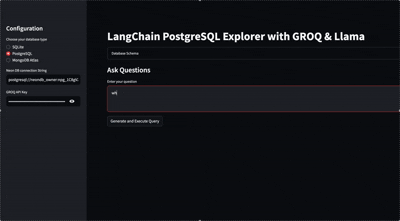

# 🧠 NeoCypher

NeoCypher is an AI-powered, natural language interface for querying and managing multiple databases — all with a single prompt. It supports SQL (MySQL, PostgreSQL, SQLite), NoSQL (MongoDB), and graph databases (Neo4j), with visualization dashboards and full CRUD capabilities.



---

## ✨ Features

- 🔍 Query databases using natural language (e.g., *"Show me all users from California who joined last month"*)
- 🔄 Supports CRUD operations (Create, Read, Update, Delete)
- 📊 Auto-generates interactive visualizations for supported queries
- 🧠 Works with:
  - 🐬 MySQL
  - 🐘 PostgreSQL
  - 🧀 SQLite
  - 🍃 MongoDB
  - 🌿 Neo4j
- 🔐 Secure and extendable architecture
- 📦 Modular pipeline: Input → NLP → Query Parsing → Execution → Output/Visualization

---

## 🚀 Getting Started

### 1. Clone the repository

```bash
git clone https://github.com/aditya-pandey-ai/neocypher.git
cd neocypher
```

### 2. Install dependencies

```bash
pip install -r requirements.txt
```

### 3. Launch NeoCypher

```bash
streamlit run new.py
```

---

## 🖼️ Demo

> *Watch NeoCypher in action:*


---

## 🧰 Tech Stack

- **Frontend**: Streamlit
- **Backend**: Python (FastAPI or Django, optional)
- **Database Drivers**: SQLAlchemy, PyMongo, Neo4j Driver
- **NLP Engine**: OpenAI / spaCy / custom parser
- **Visualization**: Plotly / Matplotlib / Streamlit charts

---

## 📁 Project Structure

```
neocypher/
├── assets/
│   └── demo.gif
├── app.py
├── query_parser/
│   └── ...
├── db_connectors/
│   └── ...
├── visualizer/
│   └── ...
├── utils/
│   └── ...
├── requirements.txt
└── README.md
```

---

## 🤝 Contributing

Pull requests are welcome! For major changes, please open an issue first to discuss what you’d like to change.

---

## 📜 License

MIT License
